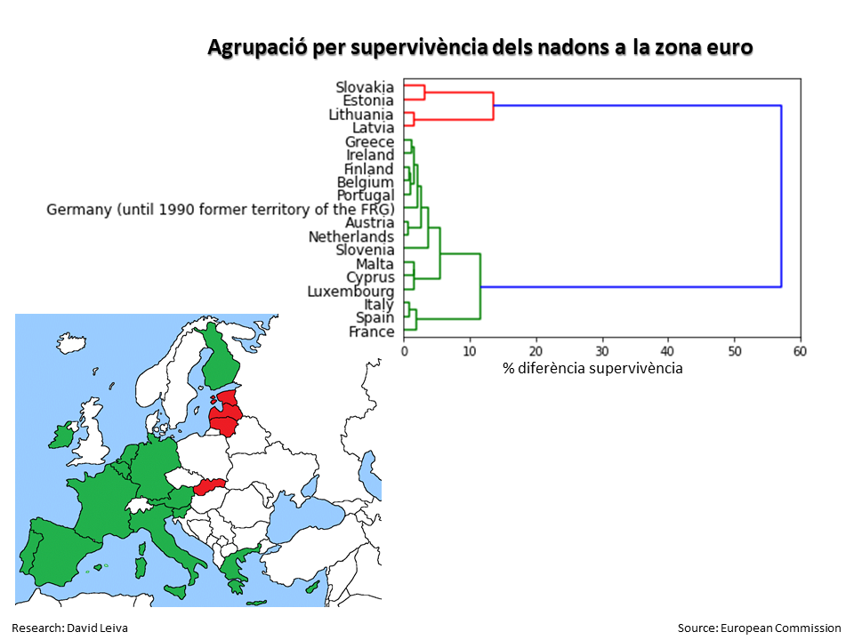
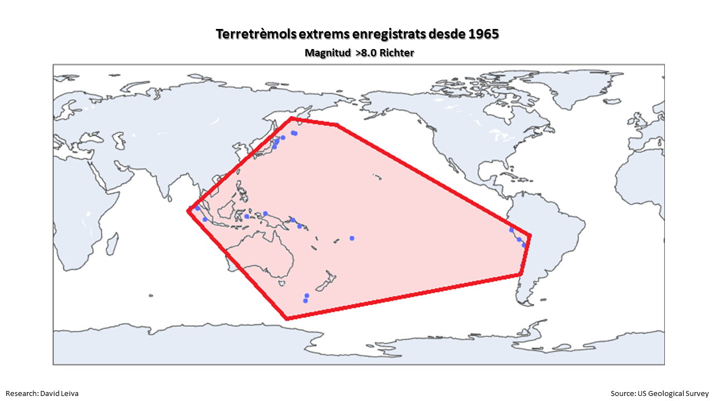

# PAC2 Estudi de tècniques de visualització de dades

## Introducció
Segona pràctica de l'assignatura Visualització de dades del Màster Universitar de Ciència de Dades de la Universitat Oberta de Catalunya (UOC).

## Visualitzacions

### Visualització 1: Circle Packing
- <a href="https://public.tableau.com/views/TempsCatalans/Dashboard1?:language=es-ES&publish=yes&:display_count=n&:origin=viz_share_link">Distribució del temps diari dels catalans</a>

### Visualització 2: Linear dendrogram
- 

### Visualització 3: Convex hull
- 

## Files
- superv_EURO.xlsx: https://ec.europa.eu/eurostat/databrowser/view/DEMO_MLEXPEC__custom_1536920/settings_1/table?lang=files:
- temps.xlsx:  https://www.idescat.cat/pub/?id=eut&n=934
- earthbrakers: US Geological Survey https://www.usgs.gov/
